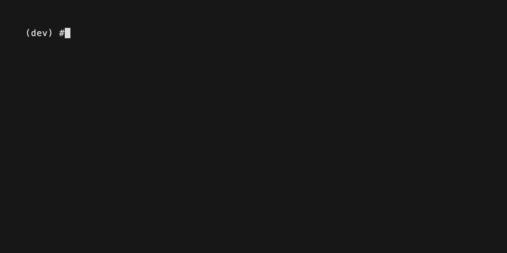
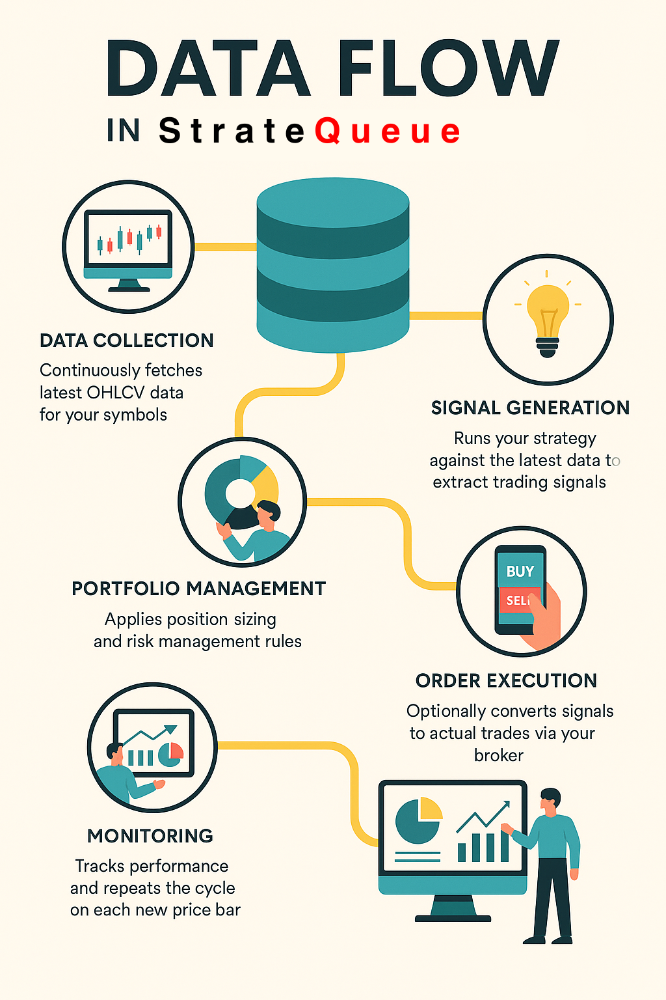

# StrateQueue[](https://twitter.com/intent/tweet?text=Take%20your%20zipline,%20vectorbt,%20backtesting.py,%20or%20backtrader%20strategies%20live%20with%20zero%20code%20changes&url=https://stratequeue.com&hashtags=python,backtesting,trading,zipline,vectorbt,quant)

[](https://badge.fury.io/py/stratequeue)[](https://www.python.org/downloads/)[](https://github.com/StrateQueue/StrateQueue/blob/main/LICENSE)[](https://pepy.tech/project/stratequeue)[](https://github.com/StrateQueue/StrateQueue/stargazers)

<!---[](https://codecov.io/gh/stratequeue/stratequeue)-->

📖**[Documenta](https://stratequeue.com/docs)**Squama 🚀**[Velox Start Guide](https://www.stratequeue.com/docs/quick-start)**Squama 💬**[Conmunitas](https://discord.gg/H4hWAXJYqX)**

> **Et celerrime iter a backtest ad vivere negotiatione**

## 🌍 readme Translations

[🇺🇸 Latina](README.md)•[🇨🇳 Simplified Chinese](README.zh-CN.md)•[Traditional Chinese](README.zh-TW.md)•[🇮🇳 Hindi](README.hi.md)•[🇫🇷 Gallica](README.fr.md)•[Arabic](README.ar.md)

Backtest vivere in seconds. Stratequeue lets deploy quis Python negotiatione belli (**backtrader**,**Zipline**,**vectorbt**,**backtrader**, Etc.) ad ulla sectorem cum uno mandatum:`stratequeue deploy --strategy ./your_script.py`. Nulla codice mutationes.

## 📑 Table of Contents

-   [StrateQueue](#stratequeue-)
    -   [🌍 readme Translations](#-readme-translations)
    -   [📑 Table of Contents](#-table-of-contents)
    -   [🎯 De Magia: a backtest ut vivere in uno imperium](#-the-magic-from-backtest-to-live-in-one-command)
        -   [Tua existentium backtest:](#your-existing-backtest)
        -   [Deploy ad Vivamus Trading:](#deploy-to-live-trading)
    -   [🛠️ Pertifisites](#️-prerequisites)
    -   [📥 Installation](#-installation)
        -   [Setup](#setup)
        -   [Dashboard (experimentalem)](#dashboard-experimental)
    -   [🔧 fulcitur integrations](#-supported-integrations)
    -   [✨ Quid stratequeue?](#-why-stratequeue)
    -   [🔄 Quomodo operatur](#-how-it-works)
    -   [Stella historia](#star-history)
    -   [⚠️ Disclaimer - Non investment consilium](#️-disclaimer--no-investment-advice)
    -   [© License](#-license)

## 🎯 De Magia: a backtest ut vivere in uno imperium

### Tua existentium backtest:

```python
class SMAStrategy(Strategy):
    def init(self):
        self.sma_short = self.I(ta.SMA, self.data.Close, 10)
        self.sma_long = self.I(ta.SMA, self.data.Close, 20)
    
    def next(self):
        if crossover(self.sma_short, self.sma_long):
            self.buy()
        elif crossover(self.sma_long, self.sma_short):
            self.sell()
```

### Deploy ad Vivamus Trading:

    pip install stratequeue
    stratequeue deploy \
      --strategy examples/strategies/backtestingpy/sma.py \
      --symbol AAPL \
      --timeframe 1m



## 🛠️ Pertifisites

-   Python**3.10**aut recentior (probata usque ad 3,11)
-   Pip et virtualis environment (commendatur)
-   (Libitum) COCIO API documentorum si cogitas ad Trade vivet (E.G. Alpaca, Interactive sectoribus)
-   (Libitum) A C Compiler pro aedificationem quaedam dependentcies (T-lib, IB, API) in Linux / Macos

## 📥 Installation

Install Core Package:

```bash
pip install stratequeue
```

Si vos postulo auxilium pro specifica engine aut vis omnia in unum ire:

```bash
# Zipline support
pip install "stratequeue[zipline]"
# Backtrader support
pip install "stratequeue[backtrader]"
# Backtesting.py support
pip install "stratequeue[backtesting]"
# VectorBT support
pip install "stratequeue[vectorbt]"
# Everything
pip install "stratequeue[all]"
```

### Setup


### Dashboard (experimentalem)

```bash
stratequeue webui
```

## 🔧 fulcitur integrations

| Integratio                  | Status        |
| --------------------------- | ------------- |
| **Backtesting engines**     |               |
| Cie ├ backtesting.py        | ✅ implemented |
| ├─ vectorbt                 | ✅ implemented |
| ├age backtrader             | ✅ implemented |
| └─ Zipline-Reloaded         | ✅ implemented |
| **Sectoribus**              |               |
| ├age alpaca                 | ✅ implemented |
| ├cam interactive sectoribus | ✅ implemented |
| ├age kraken                 | ❌ implemented |
| └─ binance                  | ❌ venire cito |
| **Data providers**          |               |
| ├age yfinance               | ✅ implemented |
| Cle Cle Polygon.io          | ✅ implemented |
| ├cam coinmarketcap          | ✅ implemented |
| ├age alpaca                 | ❌ venire cito |
| └─ Interactive sectoribus   | ❌ venire cito |

## ✨ Quid stratequeue?

**🛡️ tutum per default**- annuit, solum modus per default. Non accidentalis artium.

**🔌 engine agnostic**- Works cum backtesting.py, vectorbt, backtrader, zipline-reloaded, et magis venire cito.

**🏦 Multi-sectorem**- Unified API per Interactive sectoribus, Alpaca, et magis venire cito.

**🎯 Portfolio Management**- Deploy una Strategies vel Cart Hunests trans Tullius Rationes

## 🔄 Quomodo operatur



## Stella historia

[](https://www.star-history.com/#stratequeue/stratequeue&Timeline)

## ⚠️ Disclaimer - Non investment consilium

Stratequeue est aperta-fonte Toolkit provisum**"Sicut, est" pro educational et informational proposita tantum**.

-   Facit**non**constituere investment consilium, brokerage officia, aut commendaticiis emere aut vendere aliqua financial instrumentum.
-   Omnes negotiationem involves substantial periculo**Praeterita perficientur non indicativo futuris results**. Vos may perdere aliquas et omnia tua capitis.
-   Per usura stratequeue agnoscere quod**Tu solus es responsible pro negotiatione decisions**et conveniunt, quod stratequeue mainttainers et contibriores erit**non obnoxia pro nulla damnum vel damnum**ex usu huius software.
-   Consule qualified financial professional ante explicando vivere capitis.

## © License

Stratequeue est dimisit sub**[GNU Affero General Public License v3.0](LICENSE)**.
